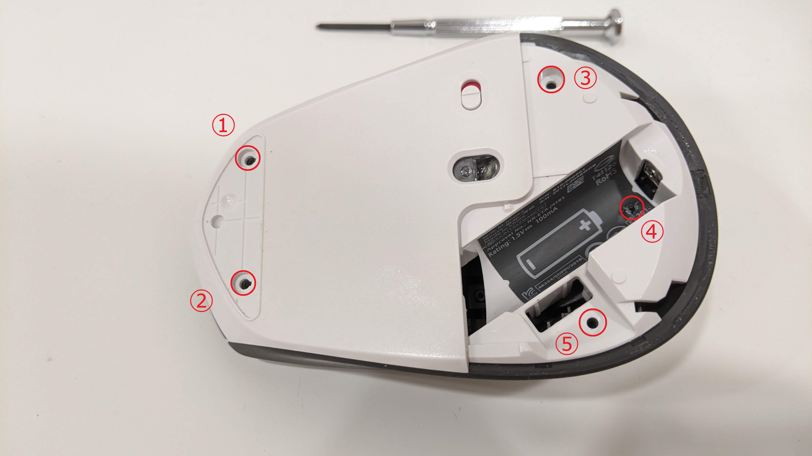
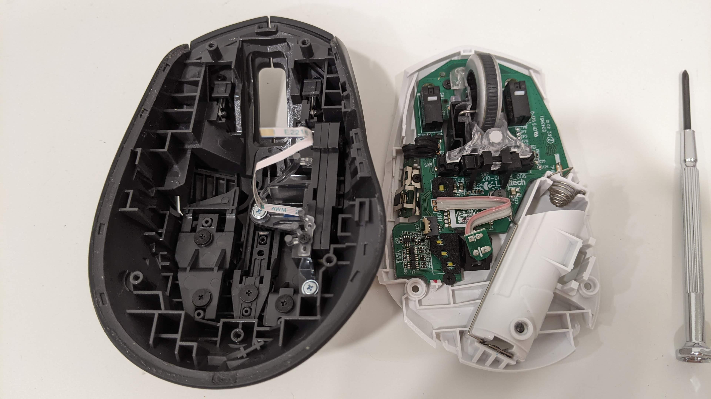
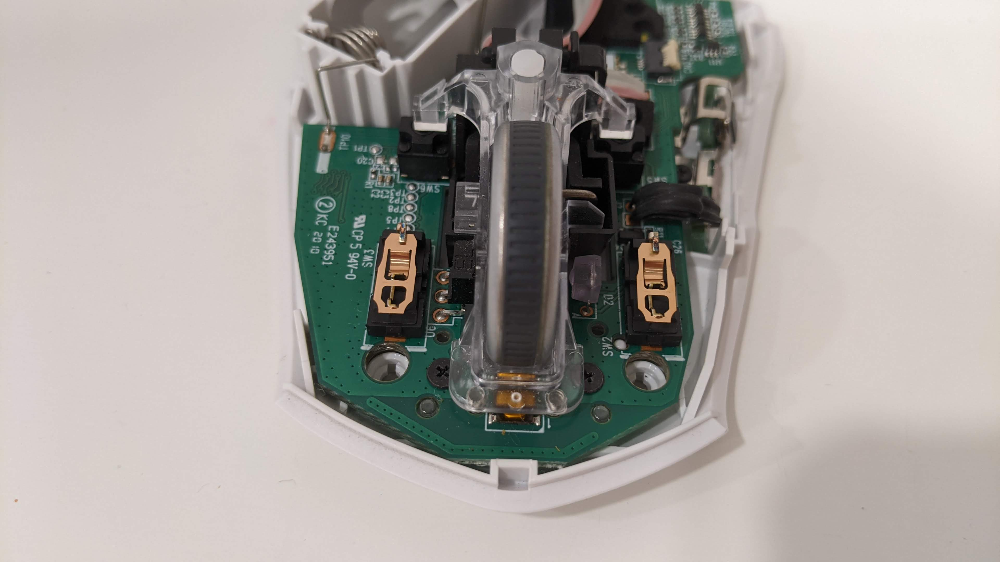

# Logitech M720 disassembly

> My mouse started randomly double-clicking on the left button, I tried to disassemble and repair it.

## Loosen five screws

## Internal structure

## Disassemble the micro switch

## Use electrical contact cleaner to clean the micro switch